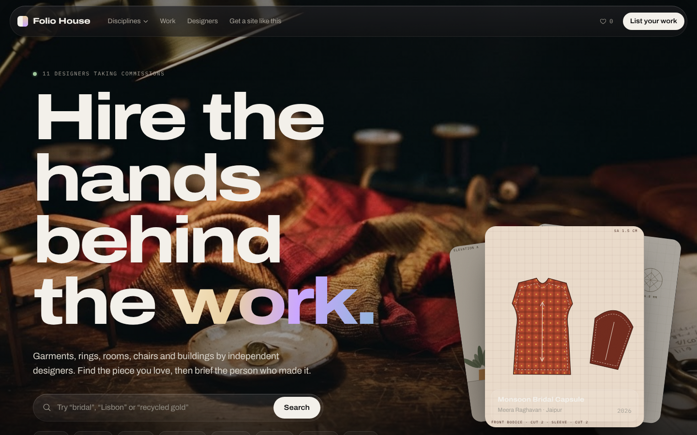
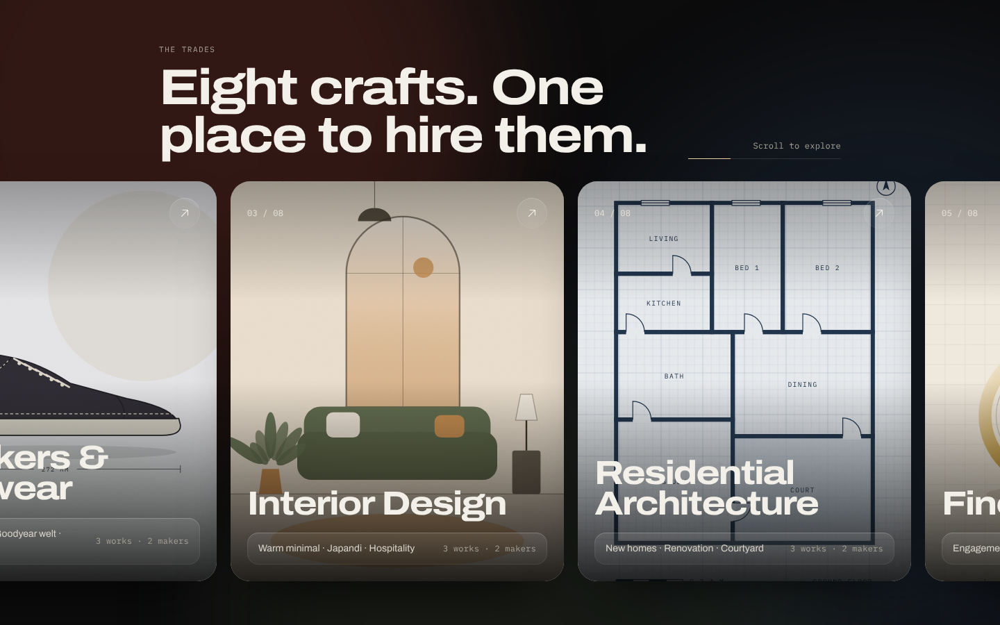
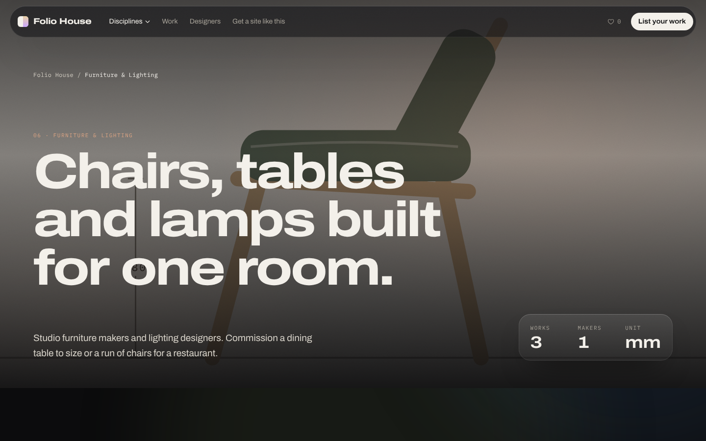
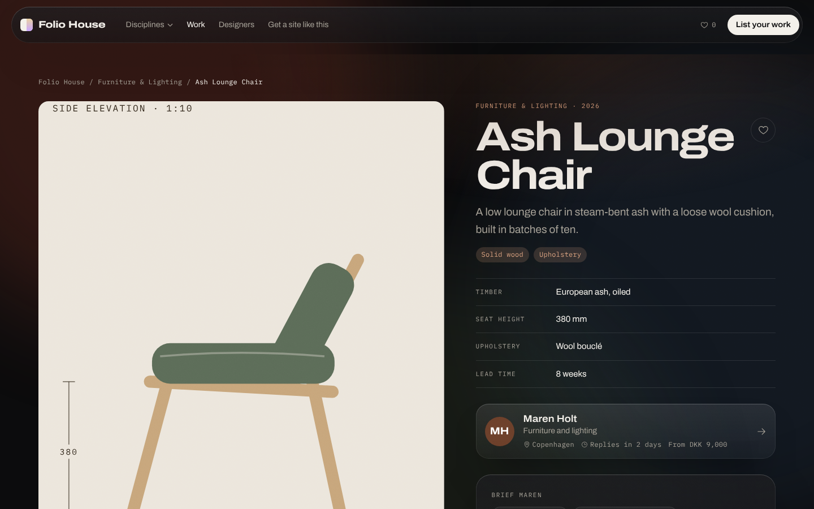
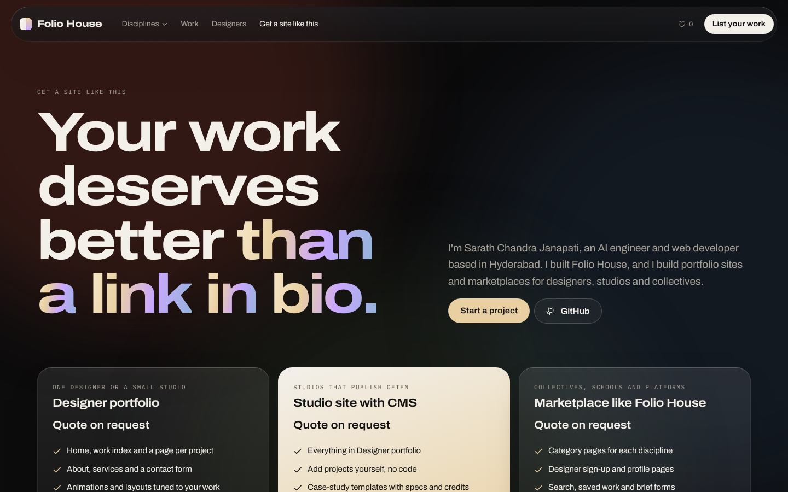
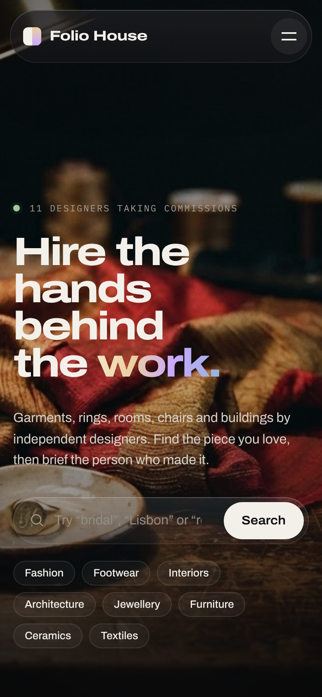

# Folio House

A portfolio marketplace for independent designers. Clients browse finished work across eight trades, open a project to see its specs, and send a brief straight to the designer who made it.



## Disciplines

| Discipline | What clients commission |
| --- | --- |
| Sustainable Fashion | Handloom capsules, upcycled tailoring, bridal |
| Sneakers & Footwear | Custom sneakers, welted shoes, small production runs |
| Interior Design | Warm minimal homes, Japandi flats, cafés |
| Residential Architecture | New homes, renovations, courtyard houses |
| Fine Jewellery | Engagement rings, recycled gold, heirloom resets |
| Furniture & Lighting | Tables to size, lounge chairs, pendants |
| Ceramics & Objects | Tableware, vessels, restaurant sets |
| Textiles & Rugs | Handwoven runners, natural dye, wall pieces |

Each discipline has its own page, accent colour and briefing prompts. Project artwork is drawn in code in each trade's own drawing language: pattern pieces, floor plans, elevations, last profiles, ring drawings, lathe profiles and loom swatches.

| Discipline rail | Discipline page |
| --- | --- |
|  |  |

| Project page | Services page |
| --- | --- |
|  |  |

## Pages

- `/` landing page with a search, a featured-work stack, the discipline index and recent work
- `/disciplines/[slug]` one page per discipline, with filters, designers and briefing prompts
- `/work` all projects with search and filters
- `/work/[id]` project page with specs, designer card and brief form
- `/designers` and `/designers/[id]` designer directory and profiles
- `/saved` a shortlist saved in the browser
- `/join` designer sign-up with a live profile preview
- `/studio` services page: get a site like this

## Look and motion

Dark gallery theme with frosted-glass navigation and panels, drifting colour glows and film grain.

- Intro counter on first visit, then a full-bleed film hero that lifts into a rounded card as you scroll
- Headlines that rise and sharpen word by word; a manifesto whose words light up with scroll
- Pinned section where vertical scroll drives the eight disciplines sideways; videos play on hover
- Stacking glass cards for the hiring steps, oversized two-way marquee, count-up stats
- 3D tilt and pointer spotlight on cards, magnetic buttons, custom cursor with context labels
- Photo / Drawing toggle on every project: the finished piece, or the maker's technical drawing
- Lenis smooth scrolling on desktop; all motion respects `prefers-reduced-motion`

## Craft notes

Built with the [Emil Kowalski design-engineering skills](https://github.com/emilkowalski/skills) and [Taste Skill](https://github.com/Leonxlnx/taste-skill) as guidelines.

- Custom ease-out curves, UI motion under 300 ms, exits faster than entrances
- Press feedback (`scale(0.97)`) on every button and card
- Clip-path tab indicator that changes colour in one motion
- Origin-aware popover menu with blur-in, circular reveal for the mobile menu
- Blurred label morphs on submit buttons, toasts from [Sonner](https://sonner.emilkowal.ski)
- Hover effects gated to fine pointers, full `prefers-reduced-motion` support
- One deliberate dark look, built from a single token set



## Stack

Next.js (App Router, static export) · React · TypeScript · Tailwind CSS v4 · Motion · Lenis · Sonner · Phosphor Icons · self-hosted Archivo and IBM Plex Mono

## Run it

```bash
npm install
npm run dev      # http://localhost:3000
npm run build    # static site in ./out
```

## Deploy to GitHub Pages

1. Push this folder to a GitHub repository (branch `main`).
2. In the repo, go to **Settings → Pages** and set **Source** to **GitHub Actions**.
3. The workflow in `.github/workflows/deploy.yml` builds and publishes on every push. The site appears at `https://<username>.github.io/<repo-name>/`.

It also deploys to Vercel or Netlify with no changes.

## Make it yours

- Content: `src/lib/data.ts` (disciplines, designers, projects)
- Services page: `src/lib/studio.ts` (name, email, packages and prices)
- Photos and videos: `src/lib/media.ts`
- Technical drawings: `src/lib/art.ts`
- Colours and type: `src/app/globals.css`

Brief and sign-up forms run in demo mode. Connecting a backend (Supabase, Firebase or a form service) turns them on.

All designers and projects shown are sample content.

## Media credits

Hero still generated with Runway (`public/media/hero-workbench.jpg`). Photos from [Unsplash](https://unsplash.com/license) and videos from [Pexels](https://www.pexels.com/license/), both free to use. Photographer names and source pages are listed in `src/lib/media.ts`. Images load from Unsplash's CDN; if one fails, the trade drawing is shown instead. For production, download compressed copies into `public/media/` and point `media.ts` at them.

---

Designed and built by [Sarath Chandra Janapati](https://github.com/Sarathchandra-Janapati). Want a site like this? See the `/studio` page or email sarathchandra.janapati@gmail.com.
